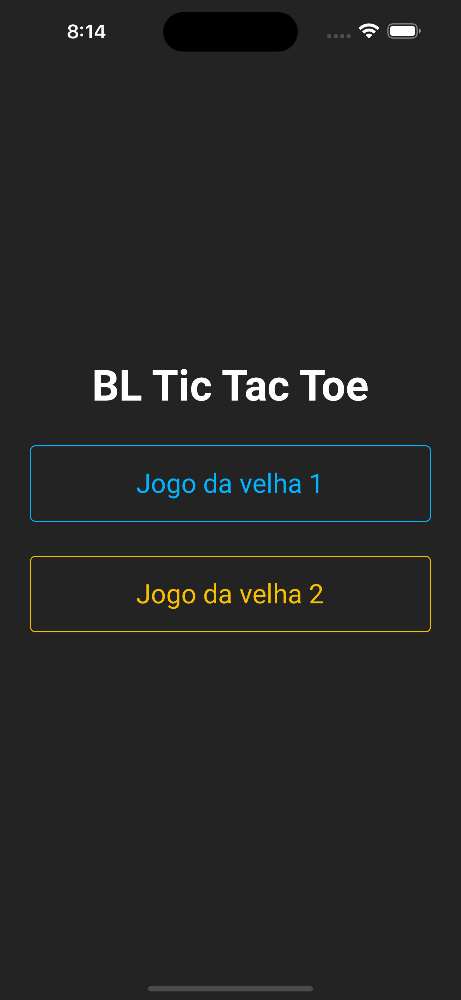

# BL Tic Tac Toe
Esta aplicação tem como objetivo inovar a maneira que se joga o jogo da velha. Adicionando novas regras e complexidades para suas estratégias.


## Capturas de Tela


|                |              Menu               |              Jogo da Velha 1               |              Jogo da Velha 2               |                |
| :------------: | :----------------------------------------: | :---------------------------------------: | :----------------------------------------: | ------------------------------------- |
|  |  |  |  |  |

## Funcionalidades Principais

- **Jogar o jogo da velha 1**: É possível jogar a primeira versão do jogo da velha.
- **Jogar o jogo da velha 2**: É possível jogar a segunda versão do jogo da velha.

## Como Usar

Para utilizar o aplicativo basta fazer a instalação do apk na pasta **github/apk** ou clonar o projeto com os seguintes passos
```
git clone https://github.com/Vinicius-B-Leite/bl-tic-tac-toe.git
npm install
npm run [android | ios]
```

## Tecnologias Utilizadas

- expo: 49.0.15,
- @shopify/restyle: 2.4.2,
- @react-navigation/native: 6.1.9
- react-native: 0.72.6


Feito com <3 por [Vinicius B Leite](https://www.linkedin.com/in/vinicius-b-leite/)


